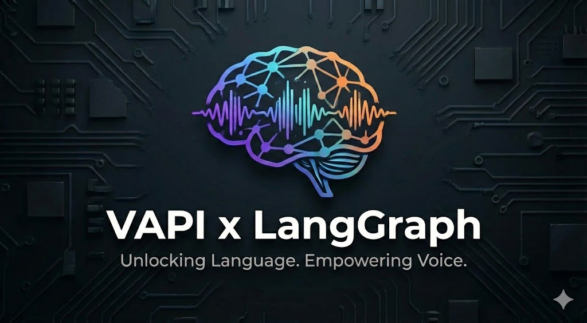
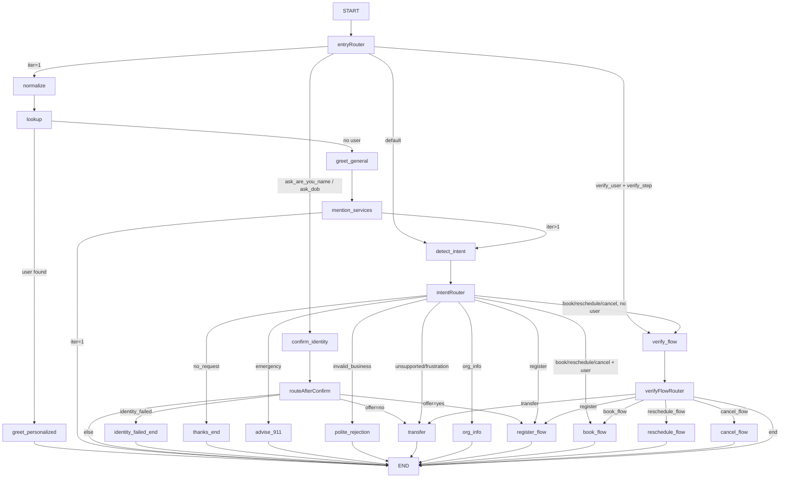
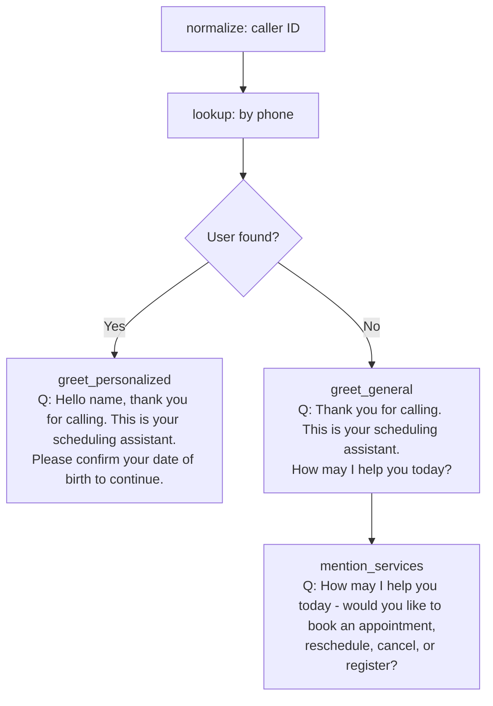
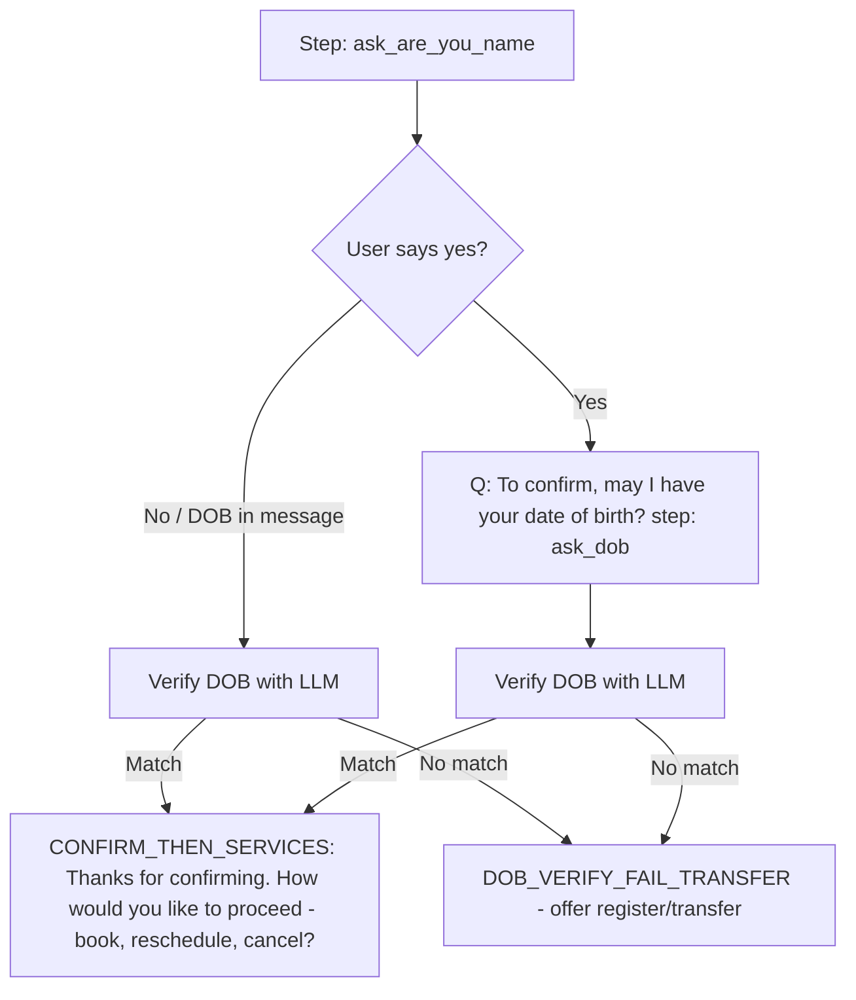
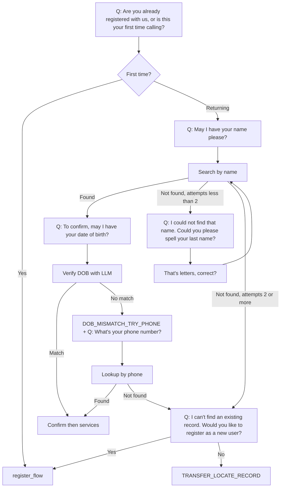
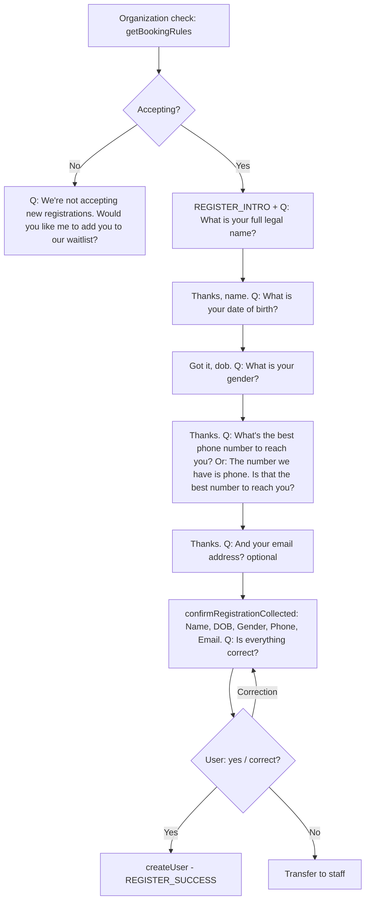
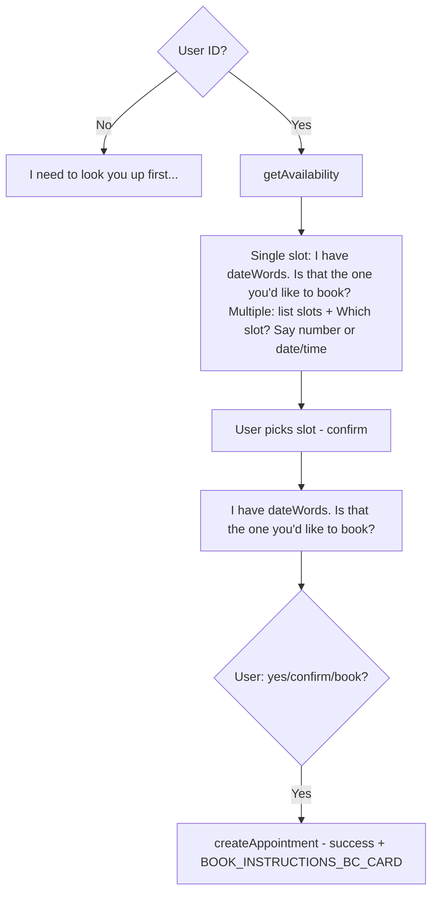
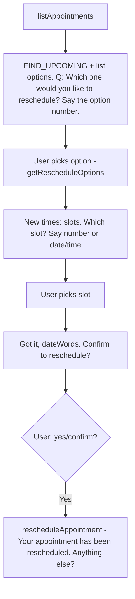
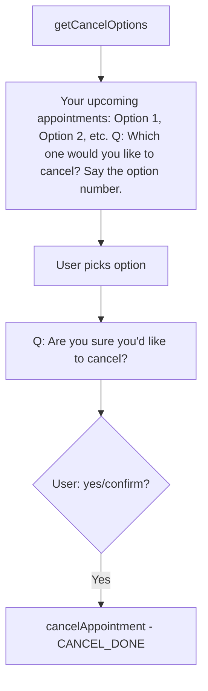
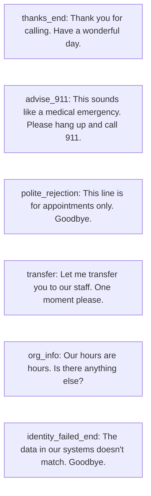

# Appointment Booking Boilerplate

<p align="center">
  
</p>

Generic appointment booking system with a conversational LLM-based scheduling assistant. Includes backend API, frontend UI, and custom LLM server with LangGraph flows for booking, rescheduling, canceling, registration, and user verification.

---

## Conversational Flow

The custom LLM server (`langgraph-customllm-vapi`) runs a LangGraph with the following intents, confirmations, verifications, and questions at each flow.

### Intent Labels (from `detectIntent`)

| Intent | Description | Next node |
|--------|-------------|-----------|
| `no_request` | User says they're done (e.g. "no", "nothing else", "goodbye") | thanks_end |
| `emergency` | User mentions emergency / 911 | advise_911 |
| `invalid_business` | Not organization business (wrong number, sales) | polite_rejection |
| `unsupported` | Request we can't handle | transfer |
| `frustration` | User is frustrated | transfer |
| `org_info` | Hours, location, general organization info | org_info |
| `register` | New user registration | register_flow |
| `book` | Book appointment (if user known → book_flow; else → verify_flow) | book_flow / verify_flow |
| `reschedule` | Change existing appointment | reschedule_flow / verify_flow |
| `cancel` | Cancel appointment | cancel_flow / verify_flow |

---

### High-Level Mermaid: Graph Structure



---

### Detailed Mermaid: Intents, Confirmations, Verifications & Questions by Flow

The following diagrams break down each flow with its intents, confirmations, verifications, and key questions.

#### 1. Entry & Greeting



#### 2. Confirm Identity (caller ID found)



#### 3. Verify User (no caller ID match)



#### 4. Register Flow



#### 5. Book Flow



#### 6. Reschedule Flow



#### 7. Cancel Flow



#### 8. End / Single-shot nodes



**Note:** In diagrams 2 and 3, outcomes like "Confirm then services" and "register_flow" connect to the Book/Reschedule/Cancel flows or Register Flow respectively.

---

### Flow Steps Summary

| Flow | Steps | Key questions / confirmations |
|------|--------|-------------------------------|
| **Confirm Identity** | `ask_are_you_name` → `ask_dob` | "Please confirm your date of birth" / "To confirm, may I have your date of birth?"; on DOB fail → DOB_VERIFY_FAIL_TRANSFER → register or transfer |
| **Verify User** | `ask_current_or_first` → `ask_name` → `ask_spell_last` → `confirm_spelling` → `ask_dob` → `ask_phone` → `offer_register_or_transfer` | "Are you already registered or first time calling?"; "May I have your name?"; "Spell your last name"; "That's {letters}, correct?"; "To confirm, may I have your date of birth?"; "What's your phone number?"; "Would you like to register?" |
| **Register** | org_check → (offer_waitlist) → name → dob → gender → phone → email → confirm_all → create | Full name, DOB, gender, phone, email (optional); "Is that the best number to reach you?"; "Is everything correct?"; corrections supported at confirm_all |
| **Book** | check → get availability → offer slots / single slot → user choice → confirm slot → create | "Which slot would you like? Say number or date/time"; "I have {dateWords}. Is that the one you'd like to book?"; success + BC card / fasting / phone instructions |
| **Reschedule** | list appointments → choose → get new slots → choose slot → confirm | "Which one would you like to reschedule?"; "Which slot?"; "Got it, {dateWords}. Confirm to reschedule?" |
| **Cancel** | list cancel options → choose → confirm | "Which one would you like to cancel?"; "Are you sure you'd like to cancel?" |

---

## Visualizing the graph in LangGraph Studio

You can visualize and debug the appointment LangGraph in [LangGraph Studio](https://docs.langchain.com/langsmith/studio) (LangSmith) by running the LangGraph dev server and connecting the cloud Studio UI to it.

### Prerequisites

- [LangSmith](https://smith.langchain.com/) account (free).
- `LANGSMITH_API_KEY` in `langgraph-customllm-vapi/.env` (create from [LangSmith API keys](https://smith.langchain.com/settings)).

### Steps

1. **Install dependencies** (including the LangGraph CLI). Use the version in `package.json` (`^1.0.0`); do **not** pin `@langchain/langgraph-cli@^0.2.0` (that version does not exist):

   ```bash
   cd langgraph-customllm-vapi
   npm install
   ```

2. **Start the LangGraph dev server** (no build needed; the graph is loaded from `./src/graph/graph.ts` so Studio can extract the schema):

   ```bash
   npx @langchain/langgraph-cli dev
   ```

   Or use the shortcut:

   ```bash
   npm run studio
   ```

3. **Open Studio**  
   The CLI prints a Studio URL, for example:

   ```text
   Studio UI: https://smith.langchain.com/studio/?baseUrl=http://127.0.0.1:2024
   ```

   Open that URL in your browser. The graph **appointment** will appear; you can inspect nodes, run the graph, and view state.

4. **Custom host/port**    
   If the server runs elsewhere (e.g. `http://localhost:3000`), use:

   ```text
   https://smith.langchain.com/studio/?baseUrl=http://localhost:3000
   ```

5. **Safari**  
   If you have issues on Safari, start the server with a tunnel:

   ```bash
   npx @langchain/langgraph-cli dev --tunnel
   ```

### Configuration

- **langgraph.json** in `langgraph-customllm-vapi/` points the **appointment** graph to `./src/graph/graph.ts:compileGraph` so the schema extractor gets a proper TypeScript AST (using `dist/graph/graph.js` can cause "Failed to extract schema" with some TypeScript/parser versions).
- The dev server runs the [Agent Server API](https://docs.langchain.com/oss/javascript/langgraph/local-server) on port **2024** by default; Studio talks to this API to visualize and run the graph.

### Notes

- The appointment graph uses **custom state** (not only `MessagesState`), so use **Graph mode** in Studio for full visualization and state inspection.
- Ensure the backend API (and any Azure/LLM env vars) are set in `.env` if you run the graph from Studio; the graph calls your API and LLM services.

### Troubleshooting

- **"No matching version found for @langchain/langgraph-cli@^0.2.0"**  
  That version does not exist. Use the version in `package.json` (e.g. `^1.0.0`). Run `npm install` from `langgraph-customllm-vapi/` so the lockfile uses the correct version.

- **"Failed to extract schema for appointment"** (with `getSymbolLinks` / `reading 'flags'`)  
  The schema extractor parses the graph file with TypeScript; pointing at compiled `.js` can trigger this. `langgraph.json` is set to `./src/graph/graph.ts:compileGraph` so the parser gets a proper AST. If you still see the error, try: (1) ensure you are not pointing at `dist/graph/graph.js`; (2) if you must use the built file, change to `./dist/graph/graph.js:compileGraph`, run `npm run build` first, and accept that schema visualization may fail in Studio (the graph can still run).

---

## Project structure

- **backend** – Appointment API (Express, Prisma): users, organizations, appointments, availability, caller ID, providers.
- **frontend** – React + Vite UI for managing organizations, providers, users, appointments, availability, caller ID, and chatbot.
- **langgraph-customllm-vapi** – LangGraph-based scheduling assistant: normalize → lookup → greet → (confirm identity or mention services) → detect intent → verify / register / book / reschedule / cancel / org_info / thanks / advise_911 / polite_rejection / transfer.

---

## Running the project

1. **Backend**: From `backend/`, copy `example.env` to `.env`, set `DEFAULT_ADMIN_USERNAME` and `DEFAULT_ADMIN_PASSWORD` (used by seed and login). Run `npm install`, `npx prisma migrate dev`, `npm run seed`, then `npm run dev`.
2. **Frontend**: From `frontend/`, run `npm install` and `npm run dev`. The app uses `VITE_API_BASE=/api` so API calls are proxied to the backend; frontend routes (e.g. `/appointments`) are not proxied, so reload works. Ensure the backend is running on port 4000. Open the app and sign in with the default admin credentials (see Admin UI below).
3. **Custom LLM server**: From `langgraph-customllm-vapi/`, copy `.env.example` to `.env`, set Azure OpenAI (or LLM), API base URL, and optionally `APPOINTMENT_API_KEY` (when backend `REQUIRE_API_KEY=true`), then run with `npm run dev` or `yarn dev`.

Refer to each package’s `package.json` and env files for scripts and required variables.

---

## Admin UI and authentication

The frontend is an **admin dashboard** (ShadCN UI, light/dark theme) protected by username/password login.

- **Login**: Default credentials come from backend env: `DEFAULT_ADMIN_USERNAME` and `DEFAULT_ADMIN_PASSWORD` (e.g. `admin` / `admin123` from `example.env`). The seed script creates this admin user.
- **Pages**: Dashboard, Users (with "View appointments" per user), Organizations, Appointments (date range: default today to today+7), API Keys (create/list), and Chat (scheduling assistant).
- **API key auth**: Public routes (caller-id, users, organizations, providers, availability, appointments) can require an `x-api-key` header. Set `REQUIRE_API_KEY=false` in backend `.env` for local dev without a key; set `true` in production and create keys via Admin → API Keys. The custom LLM reads `APPOINTMENT_API_KEY` (or `MOCK_API_KEY`) from its env and sends it as `x-api-key` when calling the backend.

See [backend/docs/API.md](backend/docs/API.md) for admin login, admin endpoints, and API key request/response details.
